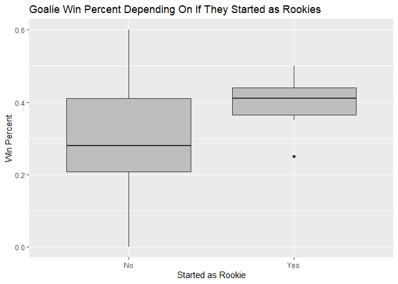
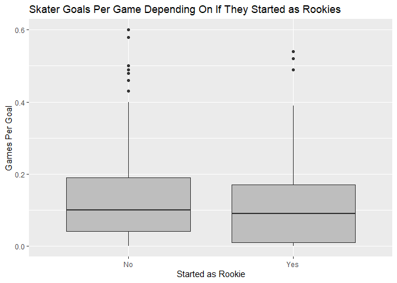
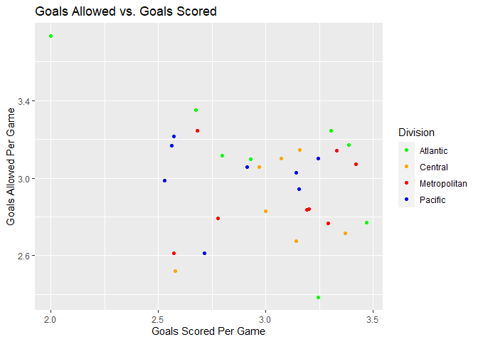
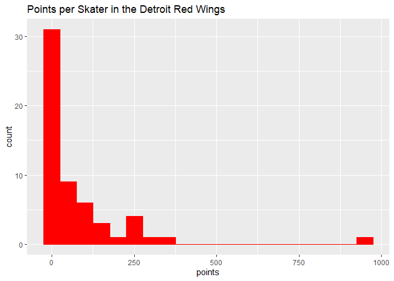
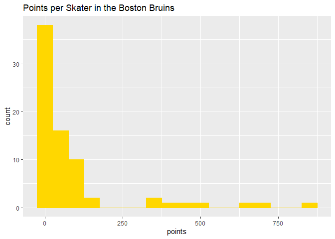

ST558 Project 1: NHL Records & Stats Analysis
================
Lynn Huang
September 18, 2020

  - [Getting Started with NHL Records & NHL Stats
    APIs](#getting-started-with-nhl-records-nhl-stats-apis)
      - [Required Packages](#required-packages)
      - [Functions](#functions)
          - [Functions for NHL Records](#functions-for-nhl-records)
          - [Function for NHL Stats](#function-for-nhl-stats)
          - [Wrapper Function](#wrapper-function)
      - [Exploratory Data Analysis](#exploratory-data-analysis)
          - [Join](#join)
          - [Create New Variables](#create-new-variables)
          - [Goalies: Contingency Tables, Numerical Summaries, Graphical
            Summaries](#goalies-contingency-tables-numerical-summaries-graphical-summaries)
          - [Skaters: Contingency Tables, Numerical Summaries, Graphical
            Summaries](#skaters-contingency-tables-numerical-summaries-graphical-summaries)
          - [Franchises & Teams: More
            Plots](#franchises-teams-more-plots)

# Getting Started with NHL Records & NHL Stats APIs

This vignette examines how to access the NHL Records API data as hosted
[here](https://gitlab.com/dword4/nhlapi/-/blob/master/records-api.md)
and the NHL Stats API data as hosted
[here](https://gitlab.com/dword4/nhlapi/-/blob/master/stats-api.md).  
All queries are prefixed with the base URL
`https://records.nhl.com/site/api` or the base URL
`https://statsapi.web.nhl.com/api/v1/` and are GET requests. The data is
returned in JSON form.  
Information is available about items such as:

  - Franchises and Teams  
  - Players, Drafts, Awards, and Milestones  
  - Trophies, Playoffs, and Win-Loss Records

## Required Packages

The following packages are required or highly recommended:

  - knitr  
  - tidyverse
  - jsonlite  
  - ggplot2

## Functions

### Functions for NHL Records

Functions are available to contact the NHL Records API and return
well-formatted, parsed data for:

  - Franchise: Team IDs, first and last seasons, and names for every
    team in the history of the NHL  
  - Franchise Team Totals: Total Wins, Losses, and Ties for every
    franchise  
  - Franchise Season Records: Season Wins, Losses, and Ties for every
    franchise  
  - Franchise Goalie Records  
  - Franchise Skater Records

Filter Information:

  - Franchise ID. EX: franchId=1 returns information about the Montreal
    Canadiens
      - The last 3 functions only accept franchiseID queries\!  
      - The last 3 functions only accept single franchiseId queries\!  
  - Franchise Name. EX: franchName=“Montréal Canadiens” returns
    information about the Montreal Canadiens
      - Note that neither “Montréal” (nor “Montreal”) nor “Canadiens”
        will work on their own  
  - Multiple IDs or Multiple Names are permitted

<!-- end list -->

``` r
recordsBaseURL <- "https://records.nhl.com/site/api/"

# Function for /franchise (id, firstSeasonId, lastSeasonId, name)
getFranchise <- function(franchId=NULL, franchName=NULL) {
  value <- "franchise"
  URL <- paste0(recordsBaseURL, value)
  apiData <- jsonlite::fromJSON(URL)
  api.df <- as_tibble(apiData[[1]])
  # If available, filter by franchId
  if (!is.null(franchId)) {
    api.df <- api.df %>% filter(id %in% franchId)
  }
  # If available, filter by franchName (not the same as teamCommonName!)
  if (!is.null(franchName)) {
    # Split each franchName string into tokens and grab the last element only for teamCommonName
    fns <- rep("", length(franchName))
    for (i in 1:length(franchName)){
      fn.tokens <- strsplit(franchName[i], " ")
      fns[i] <- tail(fn.tokens[[1]], 1)
    }
    api.df <- api.df %>% filter(teamCommonName %in% fns)
  }
  return(api.df)
}
# getFranchise()
# getFranchise(franchId=fid)
# getFranchise(franchName=fn)
# getFranchise(franchId=fid, franchName=fn)

# Function for /franchise-team-totals (total stats)
getFranchiseTeamTotals <- function(franchId=NULL, franchName=NULL) {
  value <- "franchise-team-totals"
  URL <- paste0(recordsBaseURL, value)
  apiData <- jsonlite::fromJSON(URL)
  api.df <- as_tibble(apiData[[1]])
  # If available, filter by franchId
  if (!is.null(franchId)) {
    api.df <- api.df %>% filter(franchiseId %in% franchId)
  }
  # If available, filter by franchName (same as teamName)
  if (!is.null(franchName)) {
    api.df <- api.df %>% filter(teamName %in% franchName)
  }
  return(api.df)
}
# getFranchiseTeamTotals()
# getFranchiseTeamTotals(franchId=fid)
# getFranchiseTeamTotals(franchName=fn)
# getFranchiseTeamTotals(franchId=fid, franchName=fn)

# Function for /franchise-season-records (franchise-specific season records)
getFranchiseSeasonTotals <- function(franchId=NULL) {
  # Complain that you don't have franchId, which seems like it's required for this endpoint
  if (is.null(franchId)) {
    stop("I need a franchiseId!")
  }
  value <- "franchise-season-records?cayenneExp=franchiseId="
  URL <- paste0(recordsBaseURL, value, franchId)
  apiData <- jsonlite::fromJSON(URL)
  api.df <- as_tibble(apiData[[1]])
  return(api.df)
}
# fid=1
# getFranchiseSeasonTotals()
# getFranchiseSeasonTotals(franchId=fid)

# Function for /franchise-goalie-records (franchise-specific goalie records)
getFranchiseGoalieRecords <- function(franchId=NULL) {
  # Complain that you don't have franchId, which seems like it's required for this endpoint
  if (is.null(franchId)) {
    stop("I need a franchiseId!")
  }
  value <- "franchise-goalie-records?cayenneExp=franchiseId="
  URL <- paste0(recordsBaseURL, value, franchId)
  apiData <- jsonlite::fromJSON(URL)
  api.df <- as_tibble(apiData[[1]])
  return(api.df)
}
# getFranchiseGoalieRecords()
# getFranchiseGoalieRecords(franchId=fid)

# Function for /franchise-skater-records (franchise-specific skater records)
getFranchiseSkaterRecords <- function(franchId=NULL) {
  # Complain that you don't have franchId, which seems like it's required for this endpoint
  if (is.null(franchId)) {
    stop("I need a franchiseId!")
  }
  value <- "franchise-skater-records?cayenneExp=franchiseId="
  URL <- paste0(recordsBaseURL, value, franchId)
  apiData <- jsonlite::fromJSON(URL)
  api.df <- as_tibble(apiData[[1]])
  return(api.df)
}
# getFranchiseSkaterRecords()
# getFranchiseSkaterRecords(franchId=fid)
```

### Function for NHL Stats

A function is also available to contact the NHL Stats API and return
well-formatted, parsed data for:

  - Teams: Team IDs, venues, divisions, etc. for every team in the
    history of the NHL

Please note that you can filter the results returned specifically for
these expanded modifiers. It is suggested that you filter, unless you
want a big, ugly dataframe with all the possible information you could
ever want to parse:

  - Team ID - This is different than franchiseId
      - teamId=1 is “New Jersey Devils” whereas franchiseId=1 is
        “Montréal Canadiens”  
      - Multiple teamId’s can be provided as a vector of numbers  
  - Season - The two-year identifier for an NHL season
      - season=“20192020” will get info for 2019-2020 season  
      - The API’s default is to return the current season info (so,
        2019-2020)  
  - Team Roster - Roster of active players (if specified, for teamId and
    season)
      - Return: A dataframe or list of dataframes if multiple teamId’s
        specified  
  - Person Names - Just player names (if provided, for teamId)
      - Return: A dataframe of team name and info (each row)  
  - Team Schedule Next - Details of upcoming games (if provided, for
    teamId)
      - Not all teams have upcoming games, try teamId=14 (worked as of
        9-18-2020)  
      - Return: A dataframe or list of dataframes if multiple teamId’s
        specified  
  - Team Schedule Previous - Details of previous games (if provided, for
    teamId)
      - Return: A dataframe or list of dataframes if multiple teamId’s
        specified  
  - Team Stats - Team win/loss/tie type of stats (if provided, for
    teamId)
      - Return: A dataframe (of dataframes/lists)
  - statsSingleSeasonPlayoffs (ignored due to unclear documentation in
    the NHL Stats API)

You may only select teamRoster OR personNames or teamSchedNext or
teamSchedPrev or teamStats, not a combination of them.

``` r
statsBaseURL <- "https://statsapi.web.nhl.com/api/v1/teams"

# First, a helper function to append teamId and season modifiers to the other 5 stats modifiers
getStatsHelper <- function(URL, teamId=NULL, season=NULL) {
  # Update with teamId and season data if applicable
  if (!is.null(teamId)) {
    tids <- as.character(teamId[1])
    if (length(teamId) > 1) {
      for (t in 2:length(teamId)) {
        tids <- paste0(tids, ",", teamId[t])
      }
    }
    URL <- paste0(URL, "&teamId=", tids)
  }
  if (!is.null(season)) {
    URL <- paste0(URL, "&season=", season)
  }
  return(URL)
}

# Second, the main function that actually gets API data
getStats <- function(teamId=NULL, season=NULL, teamRoster=FALSE, personNames=FALSE, 
                    teamSchedNext=FALSE, teamSchedPrev=FALSE, teamStats=FALSE) {
  # If only 1 teamId is provided (all modifiers are FALSE), don't use any modifiers
  if (!teamRoster & !personNames & !teamSchedNext & !teamSchedPrev & !teamStats & length(teamId)==1) {
    URL <- paste0(statsBaseURL, "/", teamId)
    apiData <- jsonlite::fromJSON(URL)
    api.df <- as_tibble(apiData[[2]])
    return(api.df)
  }
  
  # If any modifiers are used with teamId and season, update URL before grabbing data from API
  if (teamRoster) {
    URL <- paste0(statsBaseURL, "?expand=team.roster")
    URL <- getStatsHelper(URL, teamId, season)
    apiData <- jsonlite::fromJSON(URL)
    api.df <- apiData[[2]]
    rosters <- api.df$roster$roster
    return(rosters)
  }
  else if (personNames) {
    URL <- paste0(statsBaseURL, "?expand=person.names")
    URL <- getStatsHelper(URL, teamId, season)
    apiData <- jsonlite::fromJSON(URL)
    api.df <- as_tibble(apiData[[2]])
    return(api.df)
    }
  else if (teamSchedNext) {
    URL <- paste0(statsBaseURL, "?expand=team.schedule.next")
    URL <- getStatsHelper(URL, teamId, season)
    apiData <- jsonlite::fromJSON(URL)
    api.df <- as_tibble(apiData[[2]])
    nextGames <- api.df$nextGameSchedule$dates
    return(nextGames)
    }
  else if (teamSchedPrev) {
    URL <- paste0(statsBaseURL, "?expand=team.schedule.previous")
    URL <- getStatsHelper(URL, teamId, season)
    apiData <- jsonlite::fromJSON(URL)
    api.df <- as_tibble(apiData[[2]])
    prevGames <- api.df$previousGameSchedule$dates
    return(prevGames)
    }
  else if (teamStats) {
    URL <- paste0(statsBaseURL, "?expand=team.stats")
    URL <- getStatsHelper(URL, teamId, season)
    apiData <- jsonlite::fromJSON(URL)
    api.df <- apiData[[2]]
    return(api.df)
    }
  else {
    URL <- statsBaseURL
    apiData <- jsonlite::fromJSON(URL)
    api.df <- apiData[[2]]
    return(api.df)
  }
}
# rosters12 <- getStats(teamId=c(1,2), season="20192020", teamRoster=TRUE)
# getStats(teamId=c(1,2), season="20192020", personNames=TRUE)
# getStats(teamId=c(1,14), season="20192020", teamSchedNext=TRUE)
# getStats(teamId=c(1,14), season="20192020", teamSchedPrev=TRUE)
# getStats(teamId=c(1,2), season="20192020", teamStats=TRUE)
```

### Wrapper Function

Here is a on-stop-shop function to access any endpoint from the previous
6 functions. Input a funcType number from 1 to 6 for particular function
calls, and provide optional arguments:

1.  Franchise (franchId, franchName)  
2.  Franchise Goalie Records (franchId)  
3.  Franchise Season Totals (franchId)  
4.  Franchise Skater Records (franchId)  
5.  Franchise Team Totals (franchId, franchName)  
6.  Team and Season Level Stats (teamId, season, teamRoster,
    personNames, teamSchedNext, teamSchedPrev, teamStats)

<!-- end list -->

``` r
getNHLData <- function(funcType=c("franchise", "goalie", "season", "skater", "team", "stats"), ...) {
  switch(EXPR=funcType,
         franchise = getFranchise(...),
         goalie = getFranchiseGoalieRecords(...),
         season = getFranchiseSeasonTotals(...),
         skater = getFranchiseSkaterRecords(...),
         team = getFranchiseTeamTotals(...),
         stats = getStats(...))
}
# Testing
# f <- getNHLData("franchise", franchId=14)
# fg <- getNHLData("goalie", franchId=14)
# fs <- getNHLData("season", franchId=14)
# fk <- getNHLData("skater", franchId=14)
# ft <- getNHLData("team", franchName="Los Angeles Kings")
# s <- getNHLData("stats", teamId=26, teamRoster=TRUE)
```

## Exploratory Data Analysis

I’m originally from Los Angeles, so let’s examine some of the data for
the Los Angeles Kings. I still remember when they won the Stanley Cup in
2012 and 2014, and thinking how odd that we could win hockey tournaments
during the longest drought in California (from 2011-2016).

``` r
f <- getNHLData("franchise", franchId=14)
```

Their franchiseId is 14, teamId is 26, and they first started playing in
the 19671968 and are still playing.

### Join

We can join the information about Franchise Goalie Records and Franchise
Skater Records (both from the Records API) with the team roster from the
Stats API to get stats on the current team roster. Both of these are
left joins, where we wish to keep all information in the first table
(team roster from Stats API) and add information from the second table
(either goalie records or skater records).

``` r
fg <- getNHLData("goalie", franchId=14)
fk <- getNHLData("skater", franchId=14)
s <- getNHLData("stats", teamId=26, teamRoster=TRUE)
# Stats API function returns a list with dataframes, so make it into a nice dataframe
s <- cbind(s[[1]]$person, s[[1]]$jerseyNumber, s[[1]]$position)

# Get active players only
fg.act <- fg %>% filter(activePlayer=TRUE) %>% select(-id, -activePlayer, -franchiseId, -franchiseName,)
fk.act <- fk %>% filter(activePlayer=TRUE) %>% select(-activePlayer, -franchiseId, -franchiseName)
s.act <- s %>% filter(activePlayer=TRUE) %>% select(-link)

# Join by playerId (called id in s.act) to get goalie and skater info about current team roster
roster.Info.g <- left_join(s.act %>% filter(type=="Goalie"), fg.act, by=c("id"="playerId"))
roster.Info.fk <- left_join(s.act %>% filter(type!="Goalie"), fk.act, by=c("id"="playerId"))
roster.Info.g
```

    ##        id        fullName s[[1]]$jerseyNumber code   name   type abbreviation
    ## 1 8471734  Jonathan Quick                  32    G Goalie Goalie            G
    ## 2 8477361 Calvin Petersen                  40    G Goalie Goalie            G
    ##   firstName gameTypeId gamesPlayed lastName losses mostGoalsAgainstDates
    ## 1  Jonathan          2         644    Quick    240            2019-10-09
    ## 2      <NA>         NA          NA     <NA>     NA                  <NA>
    ##   mostGoalsAgainstOneGame mostSavesDates mostSavesOneGame mostShotsAgainstDates
    ## 1                       8     2010-12-13               51            2010-12-13
    ## 2                      NA           <NA>               NA                  <NA>
    ##   mostShotsAgainstOneGame mostShutoutsOneSeason mostShutoutsSeasonIds
    ## 1                      51                    10              20112012
    ## 2                      NA                    NA                  <NA>
    ##   mostWinsOneSeason mostWinsSeasonIds overtimeLosses positionCode
    ## 1                40          20152016             67            G
    ## 2                NA              <NA>             NA         <NA>
    ##   rookieGamesPlayed rookieShutouts rookieWins seasons shutouts ties wins
    ## 1                44              4         21      13       52    0  325
    ## 2                NA             NA         NA      NA       NA   NA   NA

``` r
roster.Info.fk
```

    ##         id           fullName s[[1]]$jerseyNumber code       name       type
    ## 1  8470604        Jeff Carter                  77    C     Center    Forward
    ## 2  8470606       Dustin Brown                  23    R Right Wing    Forward
    ## 3  8471685       Anze Kopitar                  11    C     Center    Forward
    ## 4  8473453       Trevor Lewis                  22    C     Center    Forward
    ## 5  8474563       Drew Doughty                   8    D Defenseman Defenseman
    ## 6  8476924         Martin Frk                  29    R Right Wing    Forward
    ## 7  8476947 Nikolai Prokhorkin                  74    L  Left Wing    Forward
    ## 8  8477018         Ben Hutton                  15    D Defenseman Defenseman
    ## 9  8477046        Joakim Ryan                   6    D Defenseman Defenseman
    ## 10 8477073   Kurtis MacDermid                  56    D Defenseman Defenseman
    ## 11 8477960       Adrian Kempe                   9    C     Center    Forward
    ## 12 8478020     Michael Amadio                  10    C     Center    Forward
    ## 13 8478455      Austin Wagner                  51    L  Left Wing    Forward
    ## 14 8478911           Matt Roy                   3    D Defenseman Defenseman
    ## 15 8479675       Trevor Moore                  12    C     Center    Forward
    ## 16 8479998     Mikey Anderson                  44    D Defenseman Defenseman
    ## 17 8480014    Gabriel Vilardi                  42    C     Center    Forward
    ## 18 8480113       Alex Iafallo                  19    L  Left Wing    Forward
    ## 19 8480336        Sean Walker                  26    D Defenseman Defenseman
    ## 20 8481481      Blake Lizotte                  46    C     Center    Forward
    ##    abbreviation  id.y assists firstName gameTypeId gamesPlayed goals   lastName
    ## 1             C 30297     178      Jeff          2         540   186     Carter
    ## 2            RW 30301     354    Dustin          2        1183   299      Brown
    ## 3             C 30974     617      Anze          2        1073   333    Kopitar
    ## 4             C 31227      93    Trevor          2         674    70      Lewis
    ## 5             D 31695     385      Drew          2         919   117    Doughty
    ## 6            RW 33835       2    Martin          2          17     6        Frk
    ## 7            LW 33769      10   Nikolai          2          43     4 Prokhorkin
    ## 8             D 33726      12       Ben          2          65     4     Hutton
    ## 9             D 33745       4    Joakim          2          35     1       Ryan
    ## 10            D 32682       9    Kurtis          2          90     4  MacDermid
    ## 11            C 32885      62    Adrian          2         256    41      Kempe
    ## 12            C 32903      21   Michael          2         148    16     Amadio
    ## 13           LW 33361      14    Austin          2         127    18     Wagner
    ## 14            D 33532      18      Matt          2          95     6        Roy
    ## 15            C 33864       2    Trevor          2          15     3      Moore
    ## 16            D 33930       0     Mikey          2           6     1   Anderson
    ## 17            C 33889       4   Gabriel          2          10     3    Vilardi
    ## 18           LW 33073      60      Alex          2         227    41    Iafallo
    ## 19            D 33403      26      Sean          2         109     8     Walker
    ## 20            C 33610      17     Blake          2          66     6    Lizotte
    ##                                                                                                                                                                                          mostAssistsGameDates
    ## 1                                                                                                                                                  2014-10-26, 2014-12-18, 2015-02-12, 2016-03-17, 2017-04-08
    ## 2                                                                                                                                                                                      2010-01-26, 2017-10-21
    ## 3                                                                                                                                                                          2007-12-06, 2014-12-18, 2015-12-28
    ## 4                                                              2010-11-20, 2011-03-29, 2012-03-17, 2013-02-19, 2013-03-16, 2015-03-03, 2015-12-29, 2016-11-23, 2017-10-18, 2017-11-30, 2017-12-30, 2018-02-07
    ## 5                                                                                                                                                                                                  2010-01-04
    ## 6                                                                                                                                                                                      2020-02-12, 2020-03-09
    ## 7                                                                                                                                                                                                  2019-12-27
    ## 8                                                                                                                                                                                                  2020-03-01
    ## 9                                                                                                                                                              2019-10-12, 2019-12-06, 2020-02-15, 2020-02-18
    ## 10                                                                                                                                                                                                 2017-11-30
    ## 11                                                                                                                                                             2017-03-04, 2018-02-20, 2018-03-12, 2020-02-23
    ## 12                                                                                                                                                                                                 2018-12-08
    ## 13                                     2018-11-21, 2018-11-30, 2018-12-06, 2018-12-15, 2019-01-10, 2019-02-21, 2019-02-25, 2019-03-23, 2019-04-05, 2019-10-27, 2019-11-09, 2019-11-25, 2019-12-21, 2020-02-09
    ## 14                                                                                                                                                                                                 2019-12-10
    ## 15                                                                                                                                                                                     2020-02-26, 2020-03-01
    ## 16                                                                                                                                     2020-02-29, 2020-03-01, 2020-03-05, 2020-03-07, 2020-03-09, 2020-03-11
    ## 17                                                                                                                                                             2020-02-20, 2020-02-26, 2020-03-09, 2020-03-11
    ## 18                                                                                                             2017-10-21, 2017-11-07, 2019-03-21, 2019-11-25, 2019-12-15, 2019-12-28, 2020-02-15, 2020-03-07
    ## 19                                                                                                                                                                                     2019-12-14, 2020-01-06
    ## 20 2019-10-08, 2019-10-19, 2019-10-24, 2019-11-02, 2019-11-09, 2019-11-25, 2019-11-27, 2019-12-10, 2019-12-14, 2019-12-21, 2019-12-31, 2020-02-06, 2020-02-09, 2020-02-12, 2020-02-20, 2020-02-26, 2020-02-29
    ##    mostAssistsOneGame mostAssistsOneSeason mostAssistsSeasonIds
    ## 1                   3                   38             20152016
    ## 2                   3                   33             20172018
    ## 3                   4                   57             20172018
    ## 4                   2                   16             20142015
    ## 5                   4                   50             20172018
    ## 6                   1                    2             20192020
    ## 7                   2                   10             20192020
    ## 8                   2                   12             20192020
    ## 9                   1                    4             20192020
    ## 10                  2                    5             20192020
    ## 11                  2                   21   20172018, 20192020
    ## 12                  2                   10             20192020
    ## 13                  1                    9             20182019
    ## 14                  2                   14             20192020
    ## 15                  1                    2             20192020
    ## 16                  0                    0             20192020
    ## 17                  1                    4             20192020
    ## 18                  2                   26             20192020
    ## 19                  2                   19             20192020
    ## 20                  1                   17             20192020
    ##                                                                                mostGoalsGameDates
    ## 1                                                                          2013-03-04, 2018-03-29
    ## 2                                                                                      2018-04-05
    ## 3                                                                                      2018-03-22
    ## 4                                                                                      2014-01-16
    ## 5                                                                                      2011-02-02
    ## 6                                                                                      2019-12-27
    ## 7                                                  2019-11-16, 2019-11-23, 2019-11-30, 2019-12-02
    ## 8                                                  2019-10-26, 2020-01-09, 2020-02-06, 2020-02-20
    ## 9                                                                                      2019-11-30
    ## 10                                                 2017-10-26, 2019-10-22, 2019-12-02, 2020-02-12
    ## 11                                                                                     2017-10-18
    ## 12                                                                                     2018-02-17
    ## 13                                                                         2018-12-18, 2019-02-11
    ## 14                         2019-03-21, 2019-04-06, 2019-11-02, 2019-11-27, 2019-12-07, 2019-12-17
    ## 15                                                             2020-02-09, 2020-02-20, 2020-03-07
    ## 16                                                                                     2020-03-09
    ## 17                                                             2020-02-20, 2020-03-07, 2020-03-11
    ## 18                                                                                     2020-01-30
    ## 19 2018-12-31, 2019-03-02, 2019-03-18, 2019-10-08, 2019-10-09, 2019-10-27, 2019-11-12, 2020-02-12
    ## 20                         2019-11-09, 2019-11-16, 2019-12-04, 2019-12-17, 2020-02-26, 2020-03-07
    ##    mostGoalsOneGame mostGoalsOneSeason mostGoalsSeasonIds
    ## 1                 3                 32           20162017
    ## 2                 4                 33           20072008
    ## 3                 4                 35           20172018
    ## 4                 2                 14           20172018
    ## 5                 2                 16           20092010
    ## 6                 2                  6           20192020
    ## 7                 1                  4           20192020
    ## 8                 1                  4           20192020
    ## 9                 1                  1           20192020
    ## 10                1                  3           20192020
    ## 11                3                 16           20172018
    ## 12                2                  6 20182019, 20192020
    ## 13                2                 12           20182019
    ## 14                1                  4           20192020
    ## 15                1                  3           20192020
    ## 16                1                  1           20192020
    ## 17                1                  3           20192020
    ## 18                3                 17           20192020
    ## 19                1                  5           20192020
    ## 20                1                  6           20192020
    ##    mostPenaltyMinutesOneSeason mostPenaltyMinutesSeasonIds
    ## 1                           44                    20132014
    ## 2                           80                    20052006
    ## 3                           32                    20082009
    ## 4                           30                    20162017
    ## 5                           69                    20112012
    ## 6                            4                    20192020
    ## 7                            6                    20192020
    ## 8                           14                    20192020
    ## 9                           10                    20192020
    ## 10                          57                    20172018
    ## 11                          50                    20182019
    ## 12                          10                    20192020
    ## 13                          39                    20192020
    ## 14                          10                    20192020
    ## 15                           2                    20192020
    ## 16                           0                    20192020
    ## 17                           4                    20192020
    ## 18                          22                    20182019
    ## 19                          26                    20192020
    ## 20                          20                    20192020
    ##                                                       mostPointsGameDates
    ## 1                          2014-10-26, 2014-12-18, 2015-10-22, 2017-02-09
    ## 2  2010-04-01, 2010-12-21, 2012-02-25, 2017-10-21, 2018-04-05, 2020-03-07
    ## 3                                                              2014-12-18
    ## 4                                                  2015-03-03, 2015-12-29
    ## 5                                                              2010-01-04
    ## 6                                                              2019-12-27
    ## 7                                                              2019-12-27
    ## 8                                                  2020-02-06, 2020-03-01
    ## 9              2019-10-12, 2019-11-30, 2019-12-06, 2020-02-15, 2020-02-18
    ## 10                                                 2017-11-30, 2020-02-12
    ## 11                                                             2017-10-18
    ## 12             2018-01-21, 2018-02-17, 2018-12-08, 2019-10-12, 2019-11-21
    ## 13                         2018-11-21, 2018-12-18, 2019-02-11, 2019-02-25
    ## 14                                                             2019-12-10
    ## 15             2020-02-09, 2020-02-20, 2020-02-26, 2020-03-01, 2020-03-07
    ## 16                                                             2020-03-09
    ## 17                                                 2020-02-20, 2020-03-11
    ## 18                                                             2020-01-30
    ## 19                                     2019-11-12, 2019-12-14, 2020-01-06
    ## 20                                                 2019-11-09, 2020-02-26
    ##    mostPointsOneGame mostPointsOneSeason mostPointsSeasonIds penaltyMinutes
    ## 1                  4                  66            20162017            231
    ## 2                  4                  61            20172018            700
    ## 3                  5                  92            20172018            294
    ## 4                  3                  26            20172018            171
    ## 5                  4                  60            20172018            635
    ## 6                  2                   8            20192020              4
    ## 7                  2                  14            20192020              6
    ## 8                  2                  16            20192020             14
    ## 9                  1                   5            20192020             10
    ## 10                 2                   8            20192020            115
    ## 11                 4                  37            20172018            134
    ## 12                 2                  16            20192020             24
    ## 13                 2                  21            20182019             55
    ## 14                 2                  18            20192020             18
    ## 15                 1                   5            20192020              2
    ## 16                 1                   1            20192020              0
    ## 17                 2                   7            20192020              4
    ## 18                 3                  43            20192020             48
    ## 19                 2                  24            20192020             34
    ## 20                 2                  23            20192020             20
    ##    points positionCode rookiePoints seasons
    ## 1     364            C           NA       9
    ## 2     653            R            5      16
    ## 3     950            C           61      14
    ## 4     163            C           13      12
    ## 5     502            D           27      12
    ## 6       8            R           NA       1
    ## 7      14            L           14       1
    ## 8      16            D           NA       1
    ## 9       5            D           NA       1
    ## 10     13            D            4       3
    ## 11    103            C           37       4
    ## 12     37            C            8       3
    ## 13     32            L           21       2
    ## 14     24            D           18       2
    ## 15      5            C            5       1
    ## 16      1            D            1       1
    ## 17      7            C            7       1
    ## 18    101            L           25       3
    ## 19     34            D           10       2
    ## 20     23            C           23       2

It appears there’s no information about LA Kings’ goalie Calvin
Petersen. Some quick Googling shows he actually plays mostly in the AHL
(American Hockey League) for the Ontario Reign team, which is the AHL
affiliate of the LA Kings. This API is based on NHL data, and thus would
miss out on Calvin Petersen’s info.  
Otherwise, the skater info seems to have populated well, with no such
missing player info.

### Create New Variables

I wonder if there is a correlation between the number of games played
and the percentage of wins for goalies and skaters? It seems reasonable
to think a team would play the best players most often.  
I also wonder if having played as a rookie might influence a player’s
win percentage, so let’s make a categorial variable for that.

``` r
# For goalies, let's calculate win percentage, and flag if someone is a rookie
fg.summStats <- fg %>% select(firstName, lastName, wins, gamesPlayed, rookieGamesPlayed) %>%
  mutate(winPct = round(wins/gamesPlayed, 2)) %>% 
  mutate(rookieFlag=factor(ifelse(is.na(rookieGamesPlayed), 0, 1)))

# For skaters, let's calculate goals per game
fk.summStats <- fk %>% select(firstName, lastName, goals, gamesPlayed, rookiePoints) %>% 
  mutate(gpg = round(goals/gamesPlayed, 2)) %>% 
  mutate(rookieFlag=factor(ifelse(is.na(rookiePoints), 0, 1)))
```

### Goalies: Contingency Tables, Numerical Summaries, Graphical Summaries

Let’s examine if starting as a rookie influenced win percent in goalies
or goals per game in skaters.  
About 16.3% of the LA Kings goalies once played as rookies.  
Looking at the boxplot, we see that goalies who started as rookies
tended to win more games. Perhaps a team only invests in a goalie as a
rookie if they show unusual promise or high performance.

``` r
# 1-Way Table
(t1 <- table(fg.summStats$rookieFlag))
```

    ## 
    ##  0  1 
    ## 36  7

``` r
t1[2]/(t1[1] + t1[2])
```

    ##         1 
    ## 0.1627907

``` r
# Win Percent by Rookie Flag
# Built-in summary() table returns something ugly, so we write our own function
make_table <- function(x, cn){
  min <- min(x)
  q1 <- quantile(x, probs=0.25)
  med <- median(x)
  mean <- mean(x)
  q3 <- quantile(x, probs=0.75)
  max <- max(x)
  tab <- round(rbind(min, q1, med, mean, q3, max), 2)
  rownames(tab) <- c("Min.", "1st Q.", "Median", "Mean", "3rd Q.", "Max.")
  colnames(tab) <- cn
  kable(tab)
}

# Let's look at the 5-number summaries for rookies vs. non-rookies
fg.winPct1 <- unlist(fg.summStats %>% filter(rookieFlag==1) %>% select(winPct))
make_table(fg.winPct1, cn="Started as Rookie")
```

|        | Started as Rookie |
| :----- | ----------------: |
| Min.   |              0.25 |
| 1st Q. |              0.36 |
| Median |              0.41 |
| Mean   |              0.40 |
| 3rd Q. |              0.44 |
| Max.   |              0.50 |

``` r
fg.winPct0 <- unlist(fg.summStats %>% filter(rookieFlag==0) %>% select(winPct))
make_table(fg.winPct0, cn="Didn't Start as Rookie")
```

|        | Didn’t Start as Rookie |
| :----- | ---------------------: |
| Min.   |                   0.00 |
| 1st Q. |                   0.21 |
| Median |                   0.28 |
| Mean   |                   0.30 |
| 3rd Q. |                   0.41 |
| Max.   |                   0.60 |

``` r
# Compare using box plots side-by-side
g <- ggplot(data=fg.summStats, aes(x=rookieFlag, y=winPct)) + 
  labs(title="Goalie Win Percent Depending On If They Started as Rookies", 
       x="Started as Rookie", 
       y="Win Percent")
g + geom_boxplot(fill="grey") + scale_x_discrete(labels=c("No", "Yes"))
```

<!-- -->

### Skaters: Contingency Tables, Numerical Summaries, Graphical Summaries

About 44.0% of the LA Kings skaters once played as rookies. Quite
different from the goalies\! Perhaps due to this greater likelihood of
accepting skaters as rookies, there’s not much difference in their goals
per game (see boxplot).

``` r
# 1-Way Table
(t3 <- table(fk.summStats$rookieFlag))
```

    ## 
    ##   0   1 
    ## 334 262

``` r
t3[2]/(t3[1] + t3[2])
```

    ##         1 
    ## 0.4395973

``` r
# Goals Per Game by Rookie Flag
# Let's look at the 5-number summaries for rookies vs. non-rookies
fk.gpg1 <- unlist(fk.summStats %>% filter(rookieFlag==1) %>% select(gpg))
make_table(fk.gpg1, cn="Started as Rookie")
```

|        | Started as Rookie |
| :----- | ----------------: |
| Min.   |              0.00 |
| 1st Q. |              0.01 |
| Median |              0.09 |
| Mean   |              0.11 |
| 3rd Q. |              0.17 |
| Max.   |              0.54 |

``` r
fk.gpg0 <- unlist(fk.summStats %>% filter(rookieFlag==0) %>% select(gpg))
make_table(fk.gpg0, cn="Didn't Start as Rookie")
```

|        | Didn’t Start as Rookie |
| :----- | ---------------------: |
| Min.   |                   0.00 |
| 1st Q. |                   0.04 |
| Median |                   0.10 |
| Mean   |                   0.12 |
| 3rd Q. |                   0.19 |
| Max.   |                   0.60 |

``` r
# Compare using box plots side-by-side
g2 <- ggplot(data=fk.summStats, aes(x=rookieFlag, y=gpg)) + 
   labs(title="Skater Goals Per Game Depending On If They Started as Rookies", 
        x="Started as Rookie", 
        y="Games Per Goal")
g2 + geom_boxplot(fill="grey") + scale_x_discrete(labels=c("No", "Yes"))
```

<!-- -->

### Franchises & Teams: More Plots

Let’s take a break from the LA Kings and look at all teams as a group.

``` r
# Get data for last season of games (splits: stat and rankings)
ts <- getNHLData("stats", teamStats=TRUE, season="20192020")
attributes(ts)
```

    ## $names
    ##  [1] "id"              "name"            "link"            "venue"          
    ##  [5] "abbreviation"    "teamName"        "locationName"    "firstYearOfPlay"
    ##  [9] "division"        "conference"      "franchise"       "teamStats"      
    ## [13] "shortName"       "officialSiteUrl" "franchiseId"     "active"         
    ## 
    ## $class
    ## [1] "data.frame"
    ## 
    ## $row.names
    ##  [1]  1  2  3  4  5  6  7  8  9 10 11 12 13 14 15 16 17 18 19 20 21 22 23 24 25
    ## [26] 26 27 28 29 30 31

``` r
# Pull out teamId and teamName.
n = nrow(ts)
# For each of the 31 teams that are currently active, pull out info about the division and splits (df)
# You'll need to query for each team individually
id = as.vector(ts$id)
name = as.vector(ts$name)
div = rep(NA, n)
conf = rep(NA, n)
gamesPlayed = rep(NA, n)
wins = rep(NA, n)
losses = rep(NA, n)
pts = rep(NA, n)
goalsPerGame = rep(NA, n)
goalsAgainstPerGame = rep(NA, n)
for (i in 1:n) {
  team <- getNHLData("stats", teamStats=TRUE, teamId=id[i])
  div[i]                 <- team$division$name
  conf[i]                <- team$conference$name
  gamesPlayed[i]         <- team$teamStats[[1]]$splits[[1]]$stat$gamesPlayed[1]
  wins[i]                <- team$teamStats[[1]]$splits[[1]]$stat$wins[1]
  losses[i]              <- team$teamStats[[1]]$splits[[1]]$stat$losses[1]
  pts[i]                 <- team$teamStats[[1]]$splits[[1]]$stat$pts[1]
  goalsPerGame[i]        <- team$teamStats[[1]]$splits[[1]]$stat$goalsPerGame[1]
  goalsAgainstPerGame[i] <- team$teamStats[[1]]$splits[[1]]$stat$goalsAgainstPerGame[1]
}

# Put it all together in a new dataframe
teams.df <- cbind(id, gamesPlayed, as.numeric(wins), as.numeric(losses), as.numeric(pts),
                  as.numeric(goalsPerGame), as.numeric(goalsAgainstPerGame))
teams.df <- as.data.frame(teams.df)
colnames(teams.df) <- c("id", "gamesPlayed", "wins", "losses", "pts", "goalsPerGame",
                        "goalsAgainstPerGame")
teams.df <- cbind(teams.df, name, div, conf)
```

How many teams are in each division? Pretty evenly split, as we
expected.

``` r
g3 <- ggplot(data=teams.df, aes(x=div)) + labs(x="Division")
g3 + geom_bar()
```

<!-- -->

Let’s plot goals scored vs goals allowed to see where offense and
defense intersect. Teams in the bottom right corner perform the best,
scoring more goals per game while keeping goals allowed (by opponents)
per game low. There’s no obvious patterns by division, but we can look
at the outliers a bit more (both are Atlantic teams)

``` r
g4 <- ggplot(teams.df, aes(x=goalsPerGame, y=goalsAgainstPerGame)) + 
  labs(title="Goals Allowed vs. Goals Scored", x="Goals Scored Per Game", y="Goals Allowed Per Game")
g4 + geom_point(aes(color=factor(div))) +
  scale_color_manual(name="Division", values=c("green", "orange", "red", "blue"))
```

<!-- -->

Looks like the Detroit Red Wings performed unusually poor (allowing more
goals per game while scoring few goals per game) and the Boston Bruins
performed unusually well (scoring more goals per game while allowing
fewer goals per game).

``` r
atlanticTeams.df <- teams.df %>% filter(div=="Atlantic")
g5 <- ggplot(atlanticTeams.df, aes(x=goalsPerGame, y=goalsAgainstPerGame)) + 
  labs(title="Goals Allowed vs. Goals Scored", x="Goals Scored Per Game", y="Goals Allowed Per Game")
g5 + geom_point() + geom_text(aes(label=name))
```

<!-- -->

Let’s look at the overall distribution of player scoring for the Red
Wings and Bruins. Is there a noticeable difference?  
There appear to be more high-scoring members on the Bruins than the Red
Wings.

``` r
# Red Wings teamId=17, Bruins teamId=6 (teams.df), which corresponds to franchId=12 and 6 (dataframe f)
redwings.df <- getNHLData(funcType="skater", franchId=12) %>% filter(activePlayer==TRUE)
bruins.df <- getNHLData(funcType="skater", franchId=6) %>% filter(activePlayer==TRUE)
# Make sure to filter by active members only!

g6 <- ggplot(data=redwings.df, aes(x=points)) + 
  labs(title="Points per Skater in the Detroit Red Wings")
g6 + geom_histogram(binwidth=50, color="red", fill="red")
```

<!-- -->

``` r
g7 <- ggplot(data=bruins.df, aes(x=points)) + 
  labs(title="Points per Skater in the Boston Bruins")
g7 + geom_histogram(binwidth=50, color="gold", fill="gold")
```

<!-- -->
